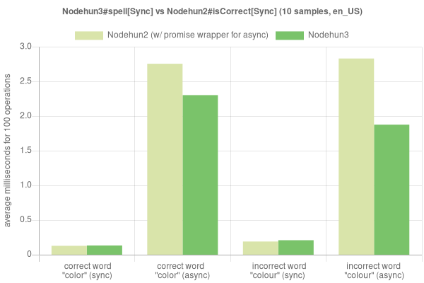
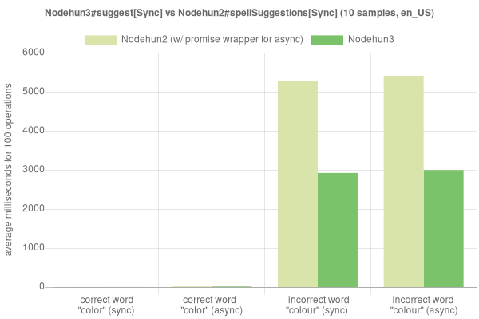

# Nodehun
[](https://badge.fury.io/js/nodehun) [](https://travis-ci.org/Wulf/nodehun) [](https://ci.appveyor.com/project/Wulf/nodehun/branch/master)

## Introduction

Nodehun aims to expose as much of hunspell's functionality as possible in an easy to understand and maintainable way, while also maintaining the performance characteristics expected of a responsible node module. 

## Features

* Native performance.
* Exposes all of hunspell's functionality:
	* Spell checking,
	* suggestions,
	* personal dictionaries and word management,
	* stems/roots of words,
	* morphological generation, and,
	* word analysis.
* TypeScript declaration file.
* Synchronous + promise-based async API.
* Extensive unit testing.
* Completely re-written using N-API (thus, stability in future v8 versions)

## Installation

	npm install nodehun

If you run into any build errors, make sure you satisfy the requirements for [`node-gyp`](https://github.com/nodejs/node-gyp#installation).

## Quick Start

```js
import { Nodehun } from 'nodehun'

const fs          = require('fs')
const affix       = fs.readFileSync('path/to/*.aff')
const dictionary  = fs.readFileSync('path/to/*.dic')

const nodehun     = new Nodehun(affix, dictionary)

// Promise example
nodehun.suggest('colour')
		   .then(suggestions => { })

// async/await example
async function example() {
	const suggestions = await nodehun.suggest('colour')
}

// sync example
const suggestions = nodehun.suggestSync('colour')
```

Note: It's probably not a good idea to use `readFileSync` in production.


## Table of Contents

1. <a href="#migration-notes">Important migration notes from v2 -> v3</a>
2. <a href="#examples">Examples</a>
	* <a href="#checking-for-correctness">Spell checking</a>
	* <a href="#spell-suggestions">Spelling suggestions</a>
	* <a href="#add-dictionary">Adding a dictionary</a>
	* <a href="#add-word">Add a word</a>
	* <a href="#add-word-with-affix">Add a word (with affix)</a>
	* <a href="#remove-word">Remove a word</a>
	* <a href="#stem">Word stem</a>
	* <a href="#analyse">Word analysis</a>
	* <a href="#generate">Word generation</a>
3. <a href="#notes">Notes</a>
	* <a href="#notes-warning-on-synchronous-methods">A Warning on Synchronous Methods</a>
	* <a href="#notes-open-office-dictionaries">A Note About Open Office Dictionaries</a>
	* <a href="#notes-creating-dictionaries">A Note About Creating Dictionaries</a>
	* <a href="#notes-finding-dictionaries">Where To Get Dictionaries</a>
4. <a href="#development">Development and Contribution</a>
	* <a href="#development-scripts">Scripts</a>
	* <a href="#development-notes">Notes</a>
	* <a href="#development-mentions">Mentions</a>

## <a id="migration-notes"></a>Important migration notes from v2 -> v3

1. The API now reflects hunspell's API almost exactly. Please see `src/Nodehun.d.ts` for the API exposed by v3.

2. Unlike Nodehun2, `suggestSync` for a word spelled correctly returns `null` instead of an empty array.
	 For example:

	```js
	nodehun2.spellSuggestionsSync('color') // => []
	nodehun3.suggestSync('color') // => null
	```

3. There are performance gains to be seen for those who wrapped the library in promises.

	
	

	To run the tests on your machine, execute `npm run performance-test` and find the graphs in the `test/performance` folder.

4. To continue using the old version, use:

	npm install --save node@2.0.12

	Works with Node v11 or lower, but some have reported compilation issues in v10 and v11.
	If you plan to use this version, please refer to the [old](https://github.com/Wulf/nodehun/blob/77e4be9e2cde8805061387d4783357c45c582a04/readme.md) readme file.


## <a id="examples"></a>Examples

The following section includes short examples of various exposed operations.
For complete examples, see the `/examples` directory.

### <a id="checking-for-correctness"></a>Checking for Correctness
Nodehun offers a method that returns true or false if the passed word exists in the dictionary, i.e. is "correct".

```js
await nodehun.spell('color') // => true
await nodehun.spell('colour') // => false, assuming en_US dictionary
```

### <a id="spell-suggestions"></a>Spelling Suggestions
Nodehun also offers a method that returns an array of words that could possibly match a misspelled word, ordered by most likely to be correct.

```js
await nodehun.suggest('color')
// => null (since it's correctly spelled)

await nodehun.suggest('calor')
// => ['carol','valor','color','cal or','cal-or','caloric','calorie']
```

### <a id="add-dictionary"></a>Add Dictionary
Nodehun also can add another dictionary on top of an existing dictionary object at runtime (this means it is not permanent) in order to merge two dictionaries. Once again, please do not actually use `readFileSync`.

```js
const en_CA = fs.readFileSync('./path/to/en_CA.dic');

await nodehun.suggest('colour') // => [ ...suggestions... ]
// because "colour" is not a defined word in the US English dictionary
await nodehun.addDictionary(en_CA)
await nodehun.suggest('colour') // => null
// (since the word is considered correctly spelled now)
```

### <a id="add-word"></a>Add Word
Nodehun can also add a single word to a dictionary at runtime (this means it is not permanent) in order to have a custom runtime dictionary. If you know anything about Hunspell you can also add flags to the word.

```js
await nodehun.suggest('colour') // => [ ...suggestions...]
// because "colour" is not a defined word in the US English dictionary
await nodehun.add('colour')
await nodehun.suggest('colour') // => null
// (since 'colour' is correct now)
```

Note: _colouring_ will still be considered incorrect. See the the `addWithAffix` example below.

### <a id="add-word-with-affix"></a>Add Word (with affix)
Like the method above, except it also applies the example word's affix definition to the new word.

```js
await nodehun.suggest('colouring') // => [ ...suggestions...]
// because "colour" is not a defined word in the US English dictionary
await nodehun.addWithAffix('colour', 'color')
await nodehun.suggest('colouring') // => null
// (since 'colouring' is correct now)
```

### <a id="remove-word"></a>Remove Word
Nodehun can also remove a single word from a dictionary at runtime (this means it is not permanent) in order to have a custom runtime dictionary. If you know anything about Hunspell this method will ignore flags and just strip words that match.

```js
await nodehun.suggest('color') // => null (since the word is correctly spelled)
await nodehun.remove('color')
await nodehun.suggest('color') // => ['colon', 'dolor', ...etc ]
```

### <a id="stem"></a>Word Stems
Nodehun exposes the Hunspell `stem` function which analyzes the roots of words. Consult the Hunspell documentation for further understanding.

```js
await nodehun.stem('telling') // => [telling, tell]
```

### <a id="analyse"></a>Word Analysis
Nodehun exposes the Hunspell `analyze` function which analyzes a word and return a morphological analysis. Consult the Hunspell documentation for further understanding.

```js
await nodehun.analyze('telling') 
// with the appropriate dictionaries files, it will return:
// => [' st:telling ts:0', ' st:tell ts:0 al:told is:Vg']
```

### <a id="generate"></a>Word Generation
Nodehun exposes the Hunspell `generate` function which generates a variation of a word by matching the morphological structure of another word. Consult the Hunspell documentation for further understanding.

```js
await nodehun.generate('telling', 'ran') // => [ 'told' ]
await nodehun.generate('told', 'run') // => [ 'tell' ]
```

## <a id="notes"></a>Notes

### <a id="notes-warning-on-synchronous-methods"></a>A Warning on Synchronous Methods
There are synchronous versions of all the methods listed above, but they are not documented as they are only present for people who really know and understand what they are doing. I highly recommend looking at the C++ source code if you are going to use these methods in a production environment as the locks involved with them can create some counterintuitive situations. For example, if you were to remove a word synchronously while many different suggestion threads were working in the background the remove word method could take seconds to complete while it waits to take control of the read-write lock. This is obviously disastrous in a situation where you would be servicing many requests.

### <a id="notes-open-office-dictionaries"></a>A Note About Open Office Dictionaries
All files must be UTF-8 to work! When you download [open office dictionaries](http://cgit.freedesktop.org/libreoffice/dictionaries/tree/) don't assume that the file is UTF-8 just because it is being served as a UTF-8 file. You may have to convert the file using the `iconv` unix utility (easy enough to do) to UTF-8 in order for the files to work.

### <a id="notes-creating-dictionaries"></a>A Note About Creating Dictionaries

If you want to create a new Hunspell dictionary you will need a base affix file. I recommend simply using one of the base affix files from the open office dictionaries for the language you are creating a dictionary for. Once you get around to creating a dictionary read the hunspell documentation to learn how to properly flag the words. However, my guess is that the vast majority of people creating dictionaries out there will be creating a dictionary of proper nouns. Proper nouns simply require the "M" flag. This is what a dictionary of proper nouns might look like:

	Aachen/M
	aardvark/SM
	Aaren/M
	Aarhus/M
	Aarika/M
	Aaron/M

Notice that the "S" flag denotes a proper noun that isn't capitalized, otherwise look in the docs.

### <a id="notes-finding-dictionaries"></a>Where To Get Dictionaries

The included dictionaries were extracted from Libre Office. The Libre Office versions have a modified aff file that makes generate() and analyze() much more useful. However, any MySpell style dictionary will work. Here are a few sources:

* [Libre Office dictionaries](http://cgit.freedesktop.org/libreoffice/dictionaries/tree/)
* [Official Aspell dictionaries](http://wordlist.aspell.net/dicts/)
* [Open Office extensions](http://extensions.services.openoffice.org/dictionary)
* [Mozilla Extensions](https://addons.mozilla.org/en-us/firefox/language-tools/)

Also, check out [@wooorm]()'s UTF-8 dictionary collection [here](https://github.com/wooorm/dictionaries).

Let the community know if you've found other dictionary repositories!

# <a id="development"></a>Development and Contribution

## <a id="development-scripts"></a>Scripts

The following is a a list of commands and their descriptions which may
help in development.

`npm start`: to jumpstart the development server. This will automatically recompile the
c++ source when changes are made and run the tests once more.

`npm run start-test`: if you don't want to continuously compile the c++ source, but do want
the tests to re-run when changes are made to the test files.

`npm run build`: to compile the addon once.

`npm test`: to run the tests once.

`npm run performance-test`: to run the performance tests and output updated graphs. (see `test/performance`)

## <a id="development-notes"></a>Notes

Make `node-gyp` build faster by increasing the number of cores it uses:

```bash
export JOBS=max
npm run build # super fast now!
```

## <a id="development-mentions"></a>Mentions

Special thanks to [@nathanjsweet](https://github.com/nathanjsweet) for his grass roots efforts with this project, including the `hunspell-distributed` package upon which this library relies to provide buffer-based Hunspell initialization.
